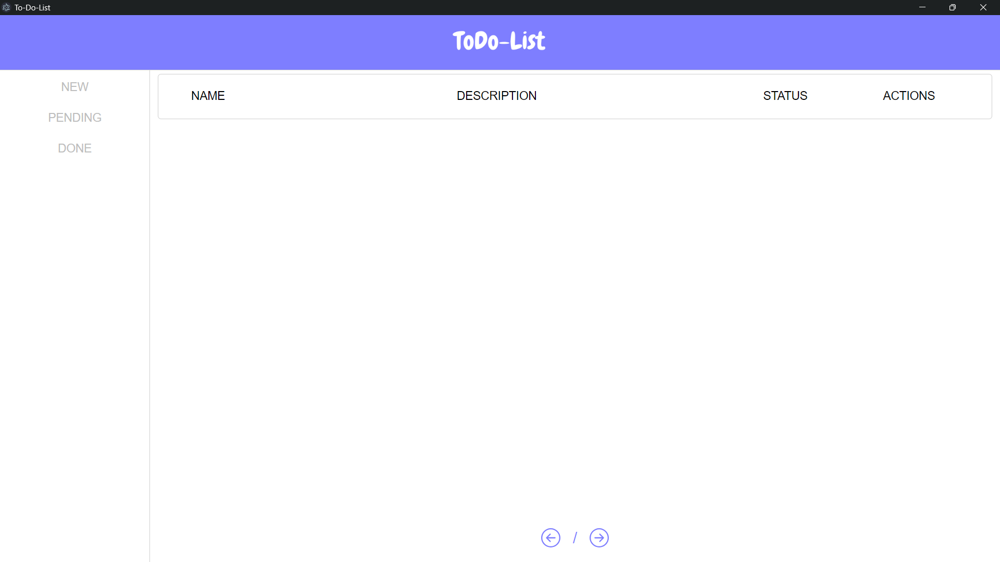
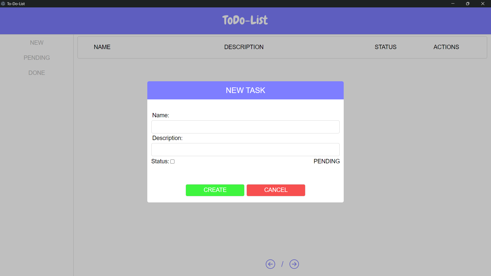

<h1 align="center">ToDo-List JS</h1>

## Descrição do Projeto

<p align="center">Aplicação de lista de tarefas utilizando JavaScript, HTML e CSS.</p>

## Ferramentas utilizadas

<ul>
  <li><p>JavaScript</p></li>
  <li><p>CSS</p></li>
  <li><p>HTML</p></li>
</ul>

## Conteúdos abordados

<ul>
  <li><p>Utilização do JavaScript em aplicações desktop</p></li>
  <li><p>Utilização de Electron</p></li>
  <li><p>Criação de componentes com JavaScript</p></li>
  <li><p>Estruturação e organização de projeto</p></li>
  <li><p>Utilização de toast</p></li>
  <li><p>Lógica de programção</p></li>
  <li><p>Estilizações com CSS</p></li>
</ul>

## Como rodar o projeto

<h6><p>1 - Ir para o diretório principal</p></h6>

```
  cd study-projects/JS-HTML-CSS/todo-list-js
```

<h6><p>2 - Baixando as dependências</p></h6>

```
  npm install
```

<h6><p>3 - Rodando o projeto</p></h6>

```
  npm start
```
## Entendendo o projeto

<p>Após seguir todos os passos o projeto será executado</p>

## Imagens do Projeto

Tela Inical 



Criação de tarefas



Tarefas pendentes


Tarefas feitas 

